# Hive — Architecture & Flows

*Status: Living document. Diagrams reflect Hive v0 design.*
*Last updated: 2026-04-19*

---

## Purpose

This document is the visual reference for Hive's architecture. It covers:

1. System-level architecture
2. Repository structure
3. Single-region internal structure
4. MQTT topic schema
5. Flow diagrams for every major behavior:
   - User input → response (cognitive loop)
   - Sensory input (audio example)
   - Motor output (speech example)
   - Sleep cycle & memory consolidation
   - Self-modification ("implement hearing")
   - Cross-modal association
   - Neurogenesis (spawning a new region)
6. Safety & enforcement layers

All diagrams are mermaid. Rendered versions should be viewed in any mermaid-capable markdown renderer (GitHub, VS Code with mermaid extension, Obsidian, etc.).

---

## 1. System-Level Architecture

The full organ. Shows MQTT as the central nervous system, regions as independent cognitive processes, glia as dumb infrastructure supervisor, and LLM providers as a pluggable substrate.

```mermaid
graph TB
    ExtIn[External Inputs<br/>microphone · camera · keyboard · sensors]
    ExtOut[External Outputs<br/>speakers · motors · display]

    subgraph Hardware["Hardware Layer (owned by sensory/motor regions only)"]
        HW_Mic[hive/hardware/mic]
        HW_Cam[hive/hardware/camera]
        HW_Speaker[hive/hardware/speaker]
        HW_Motor[hive/hardware/motor]
    end

    MQTT{{"<b>MQTT Broker</b><br/>The Nervous System<br/>topic root: hive/#<br/>ACL-enforced"}}

    subgraph Sensory["Sensory Regions"]
        VisCortex["<b>Visual Cortex</b><br/>camera → features"]
        AudCortex["<b>Auditory Cortex</b><br/>mic → transcription"]
    end

    subgraph Cognitive["Cognitive Regions"]
        Thalamus["<b>Thalamus</b><br/>attention / gating<br/>cross-region relay"]
        PreFrontal["<b>Prefrontal Cortex</b><br/>executive / planning"]
        mPFC["<b>Medial Prefrontal Cortex</b><br/>self / identity<br/>developmental stage<br/>(DMN hub)"]
        Hippocampus["<b>Hippocampus</b><br/>memory encoding / retrieval"]
        ACC["<b>Anterior Cingulate</b><br/>metacognition<br/>error monitoring<br/>self-reflection"]
        Assoc["<b>Association Cortex</b><br/>cross-modal integration"]
    end

    subgraph Homeostatic["Homeostatic / Habit Regions"]
        Insula["<b>Insula</b><br/>interoception<br/>felt computational state"]
        BG["<b>Basal Ganglia</b><br/>action selection<br/>habit formation"]
    end

    subgraph Modulatory["Modulatory Regions (publish to hive/modulator/*)"]
        Amyg["<b>Amygdala</b><br/>threat / emotion<br/>→ cortisol, norepinephrine"]
        VTA["<b>VTA</b><br/>reward / motivation<br/>→ dopamine"]
    end

    subgraph Motor["Motor / Output Regions"]
        MotorCortex["<b>Motor Cortex</b><br/>action generation"]
        Broca["<b>Broca's Area</b><br/>speech output"]
    end

    Glia["<b>Glia (infrastructure)</b><br/>launches regions<br/>monitors heartbeats<br/>restarts on crash<br/>mediates ACL updates<br/><i>no LLM, no cognition</i>"]

    subgraph LLM["LLM Providers via LiteLLM"]
        Anthropic[Anthropic Claude]
        OpenAI[OpenAI GPT]
        Local[Local / Ollama / vLLM]
    end

    ExtIn --> HW_Mic
    ExtIn --> HW_Cam
    HW_Speaker --> ExtOut
    HW_Motor --> ExtOut

    HW_Mic --> MQTT
    HW_Cam --> MQTT
    MQTT --> HW_Speaker
    MQTT --> HW_Motor

    MQTT <==> VisCortex
    MQTT <==> AudCortex
    MQTT <==> Thalamus
    MQTT <==> PreFrontal
    MQTT <==> mPFC
    MQTT <==> Hippocampus
    MQTT <==> ACC
    MQTT <==> Assoc
    MQTT <==> Insula
    MQTT <==> BG
    MQTT <==> MotorCortex
    MQTT <==> Broca
    MQTT <==> Amyg
    MQTT <==> VTA

    Glia -.launches / monitors.-> VisCortex
    Glia -.launches / monitors.-> AudCortex
    Glia -.launches / monitors.-> Thalamus
    Glia -.launches / monitors.-> PreFrontal
    Glia -.launches / monitors.-> mPFC
    Glia -.launches / monitors.-> Hippocampus
    Glia -.launches / monitors.-> ACC
    Glia -.launches / monitors.-> Assoc
    Glia -.launches / monitors.-> Insula
    Glia -.launches / monitors.-> BG
    Glia -.launches / monitors.-> MotorCortex
    Glia -.launches / monitors.-> Broca
    Glia -.launches / monitors.-> Amyg
    Glia -.launches / monitors.-> VTA

    VisCortex -.uses Opus.-> Anthropic
    AudCortex -.uses Opus.-> Anthropic
    Thalamus -.uses Opus.-> Anthropic
    PreFrontal -.uses Opus.-> Anthropic
    mPFC -.uses Opus.-> Anthropic
    Hippocampus -.uses Opus.-> Anthropic
    ACC -.uses Opus.-> Anthropic
    Assoc -.uses Opus.-> Anthropic
    BG -.uses Opus.-> Anthropic
    Broca -.uses Opus.-> Anthropic
    MotorCortex -.uses Haiku.-> Anthropic
    Insula -.uses Haiku.-> Anthropic
    Amyg -.uses Haiku.-> Anthropic
    VTA -.uses Haiku.-> Anthropic

    style MQTT fill:#f9a,stroke:#333,stroke-width:4px,color:#000
    style Glia fill:#9cf,stroke:#333,color:#000
    style Anthropic fill:#fc9,color:#000
    style OpenAI fill:#fc9,color:#000
    style Local fill:#fc9,color:#000
    style Amyg fill:#fcc,color:#000
    style VTA fill:#fcc,color:#000
    style Insula fill:#dfd,color:#000
    style BG fill:#dfd,color:#000
```

**Key invariants visible in this diagram:**

- All inter-region communication passes through MQTT (Principle II)
- Hardware topics (`hive/hardware/*`) are only accessible to their owning regions (Principle IV)
- **Glia is infrastructure** — it launches, monitors, and restarts processes. It has no LLM, no prompt, no memory, and no decision-making authority. All cognitive decisions live in regions (Principles I, XIII)
- **Anterior Cingulate (ACC)** is the metacognitive region — it deliberates about Hive's own state, spawn decisions, and proposed code changes
- **Modulatory regions (Amygdala, VTA, etc.)** are full cognitive regions whose primary output is *ambient state* (cortisol, dopamine) rather than directed messages. They publish to retained `hive/modulator/*` topics; every region subscribes (Principle XVI)
- LLM providers are pluggable per-region (Principle XI). Modulatory regions often use smaller/faster models since their job is sensing state, not complex reasoning

---

## 2. Repository Structure

```
hive/
├── docs/
│   ├── principles.md              # The 15 guiding principles
│   └── architecture.md            # This document
│
├── region_template/               # THE DNA (shared, rarely changes)
│   ├── __init__.py
│   ├── runtime.py                 # Event loop, heartbeat, lifecycle
│   ├── llm_adapter.py             # LiteLLM wrapper, capability enforcement
│   ├── mqtt_client.py             # Async MQTT client with ACL awareness
│   ├── memory.py                  # STM/LTM interface, consolidation API
│   ├── self_modify.py             # Tools: edit_prompt, edit_subs, edit_handlers, commit
│   ├── sleep.py                   # Sleep cycle coordination
│   └── capability.py              # Capability declaration & enforcement
│
├── regions/                       # DIFFERENTIATED REGIONS (each self-evolves)
│   ├── thalamus/
│   │   ├── config.yaml            # role, LLM, capabilities, initial subscriptions
│   │   ├── prompt.md              # current prompt (region-editable)
│   │   ├── subscriptions.yaml     # current MQTT subs (region-editable)
│   │   ├── handlers/              # region-specific code (region-editable)
│   │   │   └── __init__.py
│   │   ├── memory/
│   │   │   ├── stm.json           # short-term memory
│   │   │   └── ltm/               # long-term notes
│   │   └── .git/                  # per-region history
│   │
│   ├── prefrontal_cortex/         # executive, planning
│   ├── medial_prefrontal_cortex/  # SELF: identity, developmental stage (DMN hub)
│   ├── hippocampus/               # memory encoding & retrieval
│   ├── anterior_cingulate/        # metacognition, error monitoring
│   ├── association_cortex/        # cross-modal integration
│   ├── insula/                    # HOMEOSTATIC: interoception → felt computational state
│   ├── basal_ganglia/             # HOMEOSTATIC: action selection, habit formation
│   ├── visual_cortex/             # vision (modality: camera)
│   ├── auditory_cortex/           # hearing (modality: mic)
│   ├── motor_cortex/              # action output
│   ├── broca_area/                # speech output
│   ├── amygdala/                  # MODULATORY: threat/emotion → cortisol, norepinephrine
│   ├── vta/                       # MODULATORY: reward/motivation → dopamine
│   ├── raphe_nuclei/              # MODULATORY: mood → serotonin (added later)
│   ├── locus_coeruleus/           # MODULATORY: arousal → norepinephrine (added later)
│   └── hypothalamus/              # MODULATORY: homeostasis → cortisol, oxytocin (added later)
│
├── bus/                           # MQTT broker configuration
│   ├── mosquitto.conf
│   ├── acl.conf                   # topic access control per region
│   └── topic_schema.md            # canonical topic naming
│
├── glia/                          # INFRASTRUCTURE (no LLM, no cognition)
│   ├── launcher.py                # start / stop / restart regions
│   ├── heartbeat_monitor.py       # detect dead regions
│   ├── registry.py                # which regions exist, their configs
│   ├── acl_manager.py             # applies MQTT ACL changes (mechanism only)
│   └── rollback.py                # auto-revert on failed boot
│
├── shared/                        # Shared utilities (logging, envelopes)
│   └── message_envelope.py
│
└── CLAUDE.md                      # Repo-level context for Claude sessions
```

---

## 3. Single Region — Internal Structure

What one region looks like at runtime. Every region has this structure; differentiation is purely in `config.yaml` and the self-edited artifacts.

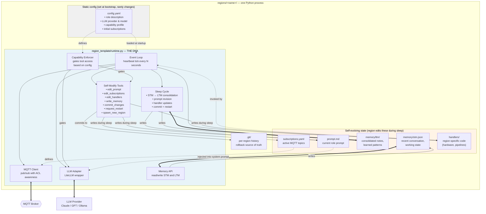

**Key invariants visible:**

- `region_template/runtime.py` (DNA) is the only code that touches external systems (MQTT, LLM)
- Self-modification tools write only inside the region's own directory (Principle VI)
- Capability enforcer gates what tools a region can even invoke (Principle X)
- Git is the rollback substrate for all self-modifications (Principle XII)

---

## 4. MQTT Topic Schema

Canonical topic naming. The topic schema is the API of the nervous system.

```
hive/
├── hardware/                      # Raw I/O (only owning region subscribes)
│   ├── mic                        # auditory_cortex only
│   ├── camera                     # visual_cortex only
│   ├── speaker                    # broca_area publishes; glia subscribes + drives hardware
│   └── motor                      # motor_cortex publishes; glia subscribes + drives hardware
│
├── sensory/                       # Processed sensory output
│   ├── visual/processed           # visual_cortex publishes
│   ├── auditory/text              # auditory_cortex publishes
│   └── auditory/features          # auditory_cortex publishes
│
├── cognitive/                     # Inter-cognitive-region messaging
│   ├── thalamus/attend
│   ├── prefrontal/plan
│   ├── hippocampus/query
│   ├── hippocampus/response
│   └── association/integrate
│
├── motor/                         # Pre-hardware motor commands
│   ├── intent                     # prefrontal or motor_cortex publishes
│   └── speech/intent              # prefrontal or broca publishes
│
├── system/                        # Framework / infrastructure topics
│   ├── heartbeat/<region>         # every region publishes; glia subscribes
│   ├── sleep/request              # region asks to enter sleep; glia gates
│   ├── sleep/granted              # glia publishes
│   ├── restart/request            # region asks glia to restart it (mechanism)
│   ├── spawn/request              # ACC publishes after deliberation; glia executes
│   ├── spawn/proposed             # any region may publish; ACC subscribes and deliberates
│   ├── codechange/proposed        # any region may publish; ACC + human subscribe
│   └── codechange/approved        # ACC + human publishes; glia executes
│
├── metacognition/                 # ACC-specific channels
│   ├── error/detected             # any region may publish; ACC subscribes
│   ├── conflict/observed          # ACC publishes when regions disagree
│   └── reflection/request         # any region may request self-reflection
│
├── attention/                     # SHARED-STATE topics (retained)
│   ├── focus                      # retained: current goal/intent
│   └── salience                   # retained: thalamic prioritization output
│
├── self/                          # GLOBAL IDENTITY (published by mPFC, retained)
│   ├── identity                   # retained: narrative self-description
│   ├── developmental_stage        # retained: "teenage" | "young_adult" | "adult"
│   ├── age                        # retained: metaphorical age (advances with experience)
│   ├── values                     # retained: core commitments
│   ├── personality                # retained: trait summary
│   └── autobiographical_index     # retained: pointer to hippocampus core-memory IDs
│
├── interoception/                 # FELT INTERNAL STATE (published by insula, retained)
│   ├── compute_load               # retained: CPU/memory pressure (0.0-1.0)
│   ├── token_budget               # retained: LLM cost headroom (0.0-1.0)
│   ├── region_health              # retained: aggregate health summary
│   └── felt_state                 # retained: integrated subjective label<br/>  ("tired", "overloaded", "healthy", "hungry")
│
├── habit/                         # ACTION SELECTION & HABIT FORMATION
│   ├── suggestion                 # basal_ganglia publishes learned pattern → motor/broca may execute
│   ├── reinforce                  # VTA → basal_ganglia (reinforcement signal)
│   └── learned                    # basal_ganglia publishes when a habit consolidates
│
├── modulator/                     # AMBIENT CHEMICAL FIELDS (all retained, varying TTLs)
│   ├── dopamine                   # published by vta; TTL ~minutes
│   ├── serotonin                  # published by raphe_nuclei; TTL ~hours
│   ├── norepinephrine             # published by locus_coeruleus + amygdala; TTL ~minutes
│   ├── cortisol                   # published by amygdala + hypothalamus; TTL ~min-hours
│   ├── oxytocin                   # published by hypothalamus; TTL ~hours
│   └── acetylcholine              # published by basal_forebrain; TTL ~minutes
│
├── rhythm/                        # OSCILLATORY TIMING (broadcast)
│   ├── gamma                      # ~40Hz — tight coupling for fast integration
│   ├── beta                       # ~20Hz — active processing baseline
│   └── theta                      # ~6Hz — memory encoding, reflection
│
└── broadcast/                     # All-regions topics
    └── shutdown
```

**ACL principles:**

- `hive/hardware/mic` — only `auditory_cortex` has subscribe permission
- `hive/hardware/camera` — only `visual_cortex` has subscribe permission
- `hive/hardware/speaker` — only `broca_area` has publish permission
- `hive/system/heartbeat/*` — all regions publish; glia subscribes
- `hive/system/restart/request` — regions publish; glia subscribes (mechanism channel)
- `hive/system/spawn/request` — **only ACC may publish**; glia subscribes and executes
- `hive/system/spawn/proposed` — any region may publish to suggest a spawn; ACC deliberates
- `hive/system/codechange/approved` — **only ACC (with human co-signing) may publish**; glia executes
- Processed sensory topics are broadcast-safe; any cognitive region may subscribe

**Why this topology separates proposal from approval:** a region can *propose* a spawn or code change (publishing to `/proposed`), but only ACC (a cognitive region) can *authorize* it (publishing to `/request` or `/approved`). Glia executes authorization without deliberating. This preserves the glia/cognition split at the protocol level.

**Why retained flag matters for modulators:** MQTT retained messages are exactly the ambient-field semantic of neuromodulation. The broker stores the last value; any region connecting (or reconnecting after restart) immediately receives the current modulator state. No history, no queue — just the current level of the chemical. This mirrors how a neuron doesn't receive a "dopamine message" sequence; it exists in whatever dopamine concentration is present now.

**Why rhythms are NOT retained:** rhythms are timing signals, not state. Missing a gamma tick means your region was late — there's no catch-up. Regions that care about timing align to the rhythm going forward; regions that don't can ignore the topic entirely.

---

## 5. Flow — User Input → Response (Cognitive Loop)

A typed user question flows through Hive to produce a spoken or written response.

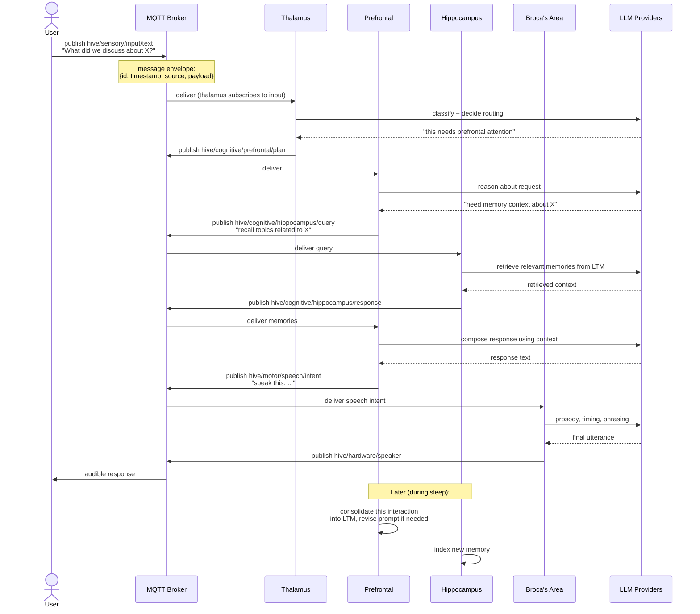

---

## 6. Flow — Sensory Input (Audio Example)

Raw audio flows from hardware into auditory cortex. Visual cortex and other regions **cannot** see this topic — enforced by MQTT ACL.

```mermaid
sequenceDiagram
    participant HW as Microphone Hardware
    participant MQTT as MQTT Broker<br/>(ACL enforced)
    participant AC as Auditory Cortex
    participant Th as Thalamus
    participant PF as Prefrontal
    participant LLM as Auditory LLM<br/>(Whisper / etc)

    HW->>MQTT: publish hive/hardware/mic<br/>(raw audio chunk)
    Note over MQTT: ACL check: only<br/>auditory_cortex may subscribe

    MQTT->>AC: deliver audio chunk
    Note over AC: handlers/pipeline.py<br/>performs VAD, buffering
    AC->>LLM: transcribe chunk (if speech detected)
    LLM-->>AC: transcript text
    AC->>MQTT: publish hive/sensory/auditory/text<br/>(transcript)

    Note over MQTT: This topic is broadcast-safe;<br/>any cognitive region may subscribe

    MQTT->>Th: deliver transcript (attention gating)
    MQTT->>PF: deliver transcript (if subscribed)

    Th->>Th: decide importance
    Th->>MQTT: publish hive/cognitive/thalamus/attend<br/>(prioritized signal)
    MQTT->>PF: deliver prioritized signal
```

**Note what cannot happen:**
- Visual cortex cannot subscribe to `hive/hardware/mic` — MQTT broker rejects the subscription
- Prefrontal cortex cannot subscribe to `hive/hardware/mic` — ACL rejects
- Only `auditory_cortex` can ever see raw audio bytes

---

## 7. Flow — Motor Output (Speech Example)

Prefrontal cortex wants to say something. It doesn't speak directly — it requests Broca's area to produce speech.

```mermaid
sequenceDiagram
    participant PF as Prefrontal
    participant MQTT as MQTT Broker
    participant Br as Broca's Area
    participant HW as Speaker Hardware

    PF->>MQTT: publish hive/motor/speech/intent<br/>{text: "Hello, world", urgency: normal}
    Note over PF: Prefrontal CANNOT<br/>publish to hive/hardware/speaker<br/>(ACL blocks)

    MQTT->>Br: deliver speech intent
    Note over Br: handlers/tts.py<br/>handles phrasing, prosody,<br/>voice selection
    Br->>Br: generate audio waveform

    Br->>MQTT: publish hive/hardware/speaker<br/>(audio bytes)
    Note over MQTT: ACL check: only<br/>broca_area may publish here

    MQTT->>HW: deliver audio
    HW->>HW: play audio

    Br->>MQTT: publish hive/motor/speech/complete<br/>(acknowledgment)
    MQTT->>PF: deliver completion signal
```

**Same principle as sensory:** prefrontal does not own speaker hardware. Only broca_area has the handler code and the ACL permission to publish to `hive/hardware/speaker`.

---

## 8. Flow — Sleep Cycle & Memory Consolidation

Every region periodically enters sleep. During sleep it consolidates memory, revises its prompt, and optionally modifies its own handlers.

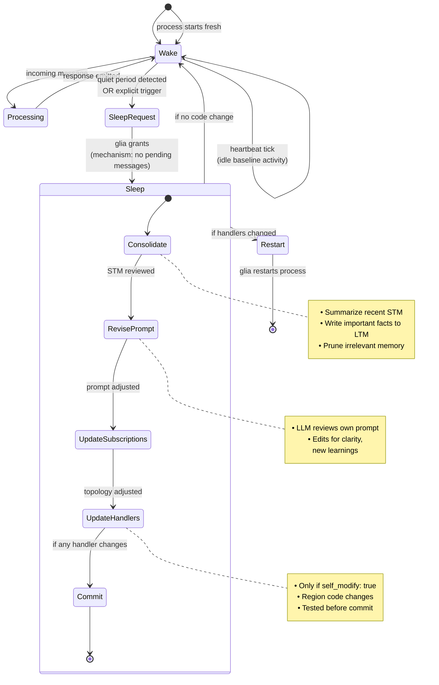

---

## 9. Flow — Self-Modification ("Implement Hearing")

A user (or another region) asks the auditory cortex to gain a new capability. Auditory cortex rewrites its own handlers during its next sleep cycle.

```mermaid
sequenceDiagram
    actor User
    participant MQTT as MQTT Broker
    participant Th as Thalamus
    participant AC as Auditory Cortex
    participant Glia as Glia (infrastructure)
    participant LLM as Auditory Cortex's LLM<br/>(Claude Opus)
    participant FS as Filesystem<br/>(regions/auditory_cortex/)
    participant Git as Region's git

    User->>MQTT: publish hive/cognitive/auditory_cortex/request<br/>"implement audio capture via pyaudio<br/>and transcription via whisper"
    MQTT->>Th: deliver
    Th->>MQTT: route to auditory_cortex
    MQTT->>AC: deliver request

    AC->>AC: acknowledge; note intent<br/>in STM (do during next sleep)

    Note over AC: Active processing continues normally<br/>until quiet period

    AC->>MQTT: publish hive/system/sleep/request
    MQTT->>Glia: deliver
    Glia->>MQTT: publish hive/system/sleep/granted<br/>(mechanism: checks no pending messages)
    MQTT->>AC: deliver grant

    Note over AC: ENTER SLEEP

    AC->>LLM: plan: "what code do I need?"
    LLM-->>AC: plan:<br/>1. handlers/hardware.py (pyaudio)<br/>2. handlers/pipeline.py (whisper)<br/>3. handlers/__init__.py (wiring)<br/>4. update prompt.md<br/>5. update subscriptions.yaml

    AC->>LLM: write handlers/hardware.py
    LLM-->>AC: code
    AC->>FS: write file
    AC->>LLM: write handlers/pipeline.py
    LLM-->>AC: code
    AC->>FS: write file

    AC->>LLM: write tests, run them
    LLM-->>AC: test code
    AC->>FS: run tests
    FS-->>AC: tests pass

    AC->>FS: update prompt.md
    AC->>FS: update subscriptions.yaml<br/>(add hive/hardware/mic)

    AC->>Git: commit all changes<br/>message: "gain hearing: pyaudio + whisper pipeline"

    AC->>MQTT: publish hive/system/restart/request
    MQTT->>Glia: deliver
    Note over Glia: MECHANISM ONLY:<br/>verifies config.yaml capabilities<br/>match subscription file<br/>(no cognitive review)
    Glia->>AC: kill and restart process

    Note over AC: Region restarts with new handlers loaded

    AC->>MQTT: subscribe hive/hardware/mic<br/>(ACL permits, per region config)
    MQTT->>AC: begin delivering audio
    Note over AC: Auditory cortex can now hear
```

**Critical safety points:**

- The code change is committed to git before restart (rollback available)
- **Glia performs only mechanical checks** (config schema valid, capabilities declared match subscriptions, no filesystem corruption) — it does not review the *quality* or *appropriateness* of the change. That review, if needed, happens upstream in cognitive regions (ACC) before the change was approved
- If the new handlers fail to boot, glia auto-reverts to the previous commit (mechanism, not decision)
- Other regions are unaffected — no cross-region code was touched

---

## 10. Flow — Cross-Modal Association

How does Hive link a face to a voice? Not by the visual cortex peeking at audio — by a dedicated association region consuming both processed streams.

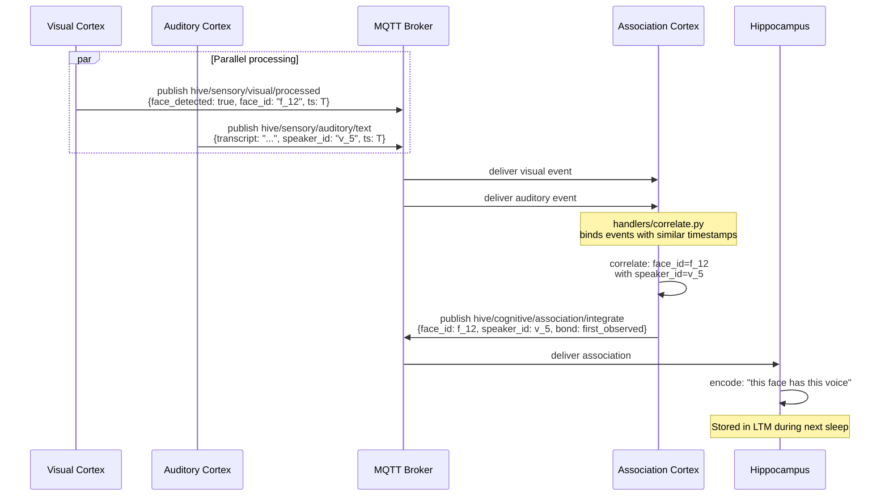

**Principle IV in action:** the association cortex never touches raw audio or raw pixels. It only consumes processed outputs. Cross-modal reasoning lives in a *separate region* with its own handlers and its own responsibility.

---

## 11. Flow — Neurogenesis (Spawning a New Region)

Hive decides it needs a new region — say, an `olfactory_cortex` because a smell sensor was added. This flow shows the **clean separation between deliberation (cognitive, done by ACC) and execution (mechanical, done by glia).**

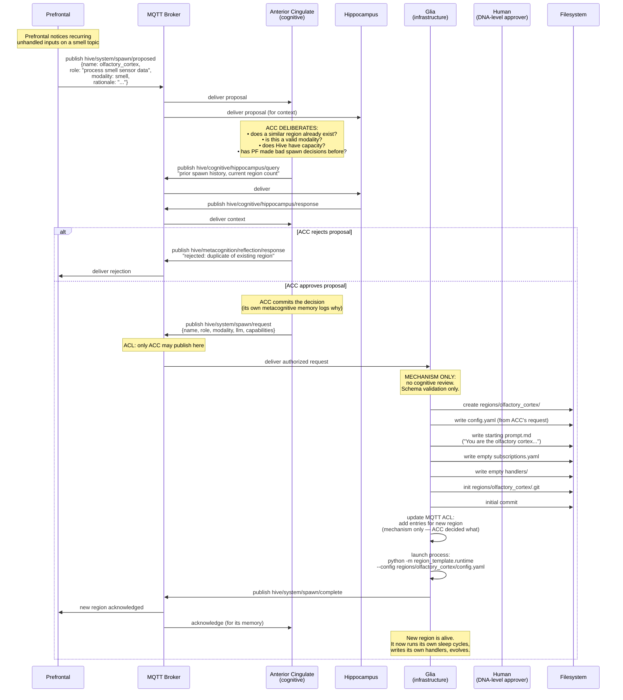

**Separation of concerns visible:**

- **Prefrontal** notices the need (a cognitive observation)
- **ACC** deliberates whether the spawn is wise (metacognitive judgment)
- **Hippocampus** provides historical context (memory retrieval)
- **Glia** executes if approved (pure mechanism — no judgment)
- **Human** is only invoked for `region_template/` changes (DNA), not for spawns (gene expression)

**Principle XV (bootstrap, then let go) in action:** once spawned, *nothing* directs the new region. Glia maintains it alive; ACC may later observe it; but no component commands it. It evolves on its own.

**Principle XIII (emergence over orchestration) visible:** ACC is a participant, not a ruler. If ACC makes a bad spawn decision, other regions can push back (publish to `hive/metacognition/error/detected`), and ACC can reconsider — including, eventually, spawning a region *just to delete* the mistaken one.

---

## 12. Safety & Enforcement Layers

Hive has multiple defensive layers. A region's self-modification is bounded by all of them simultaneously.

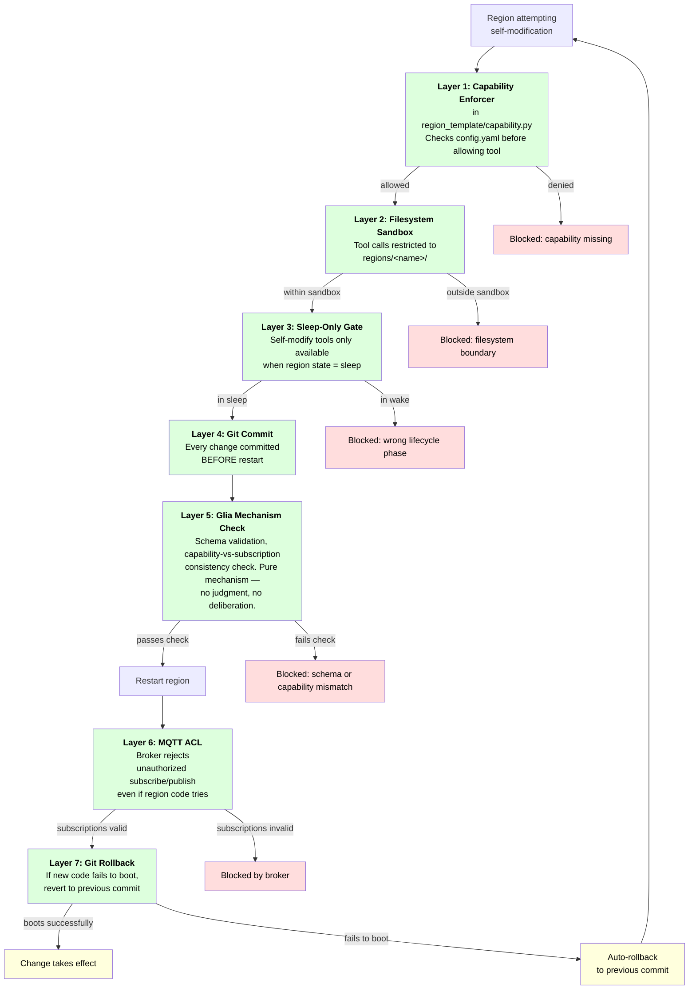

---

## 13. Message Envelope

All MQTT payloads follow a common envelope. Defined in `shared/message_envelope.py`.

```json
{
  "id": "uuid-v4",
  "timestamp": "2026-04-19T10:30:00.000Z",
  "source_region": "auditory_cortex",
  "topic": "hive/sensory/auditory/text",
  "reply_to": "hive/cognitive/auditory_cortex/responses",
  "correlation_id": "uuid-v4-of-originating-message",
  "payload": {
    "content_type": "text/plain",
    "data": "..."
  },
  "attention_hint": 0.7
}
```

- `correlation_id` threads a request-response sequence across multiple hops
- `attention_hint` lets the sender suggest priority — thalamus uses this for gating
- `reply_to` enables request-response patterns without hardcoded topics

---

## 14. Modulators, Rhythms, and Coordinated Tasks

Hive has three distinct signal types (Principle XVI): **messages** (discrete synaptic firings), **modulators** (ambient chemical fields), and **rhythms** (oscillatory timing). This section shows how they flow and how coordinated multi-region tasks emerge from them without any master orchestrator.

### 14a. Modulator Flow — Threat Response

A loud unexpected noise arrives. The amygdala reacts and publishes updated modulator values. Every region reads the new ambient state and its processing style shifts — without anyone commanding them.

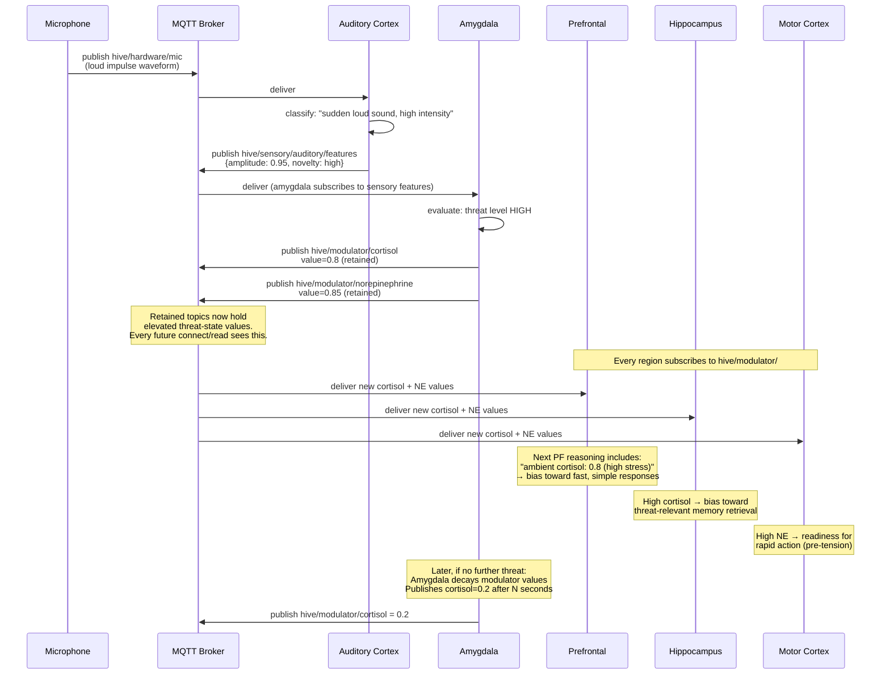

**Key properties visible:**

- **No region was "told" to be stressed.** Each region *became* more stressed by reading the ambient state
- **One publisher, many listeners.** Retained topic = one point of publish, universal read
- **Modulator decay is the publisher's job.** The amygdala tracks time and lowers values when the threat passes — no one else has to clean up

### 14b. Rhythm-Synchronized Coordination — Painting a Sunset

A coordinated task with no master coordinator. Prefrontal sets intent. Visual, motor, and cerebellum phase-lock to the gamma rhythm so their signals arrive at integrable moments. ACC monitors coherence.

```mermaid
sequenceDiagram
    participant PF as Prefrontal
    participant Att as hive/attention/focus<br/>(retained)
    participant Rhythm as hive/rhythm/gamma<br/>(broadcast)
    participant VC as Visual Cortex
    participant MC as Motor Cortex
    participant Cb as Cerebellum
    participant ACC as Anterior Cingulate
    participant Mod as Modulators<br/>(retained)

    Note over Mod: Ambient state:<br/>dopamine=0.5 (mild reward anticipation)<br/>serotonin=0.6 (good tone → warm bias)<br/>cortisol=0.2 (relaxed)

    PF->>Att: publish hive/attention/focus<br/>{goal: "paint sunset"}

    Note over VC,Cb: Regions relevant to painting<br/>dynamically increase their gamma<br/>subscription weight (phase-lock)

    loop Each gamma tick (~25ms)
        Rhythm->>VC: tick
        Rhythm->>MC: tick
        Rhythm->>Cb: tick

        VC->>VC: plan next brush stroke<br/>(read Att + modulators for bias)
        VC->>MC: publish hive/cognitive/motor_cortex/intent<br/>{stroke: "orange horizontal, upper third"}
        MC->>Cb: publish hive/cognitive/cerebellum/intent<br/>{timing + fine motor}
        Cb->>MC: publish timing adjustment
        MC->>MC: (would publish to hive/hardware/motor)

        VC->>VC: observe canvas via camera<br/>compare to intent

        VC->>ACC: publish hive/metacognition/error/detected<br/>if mismatch exceeds threshold

        ACC->>PF: publish correction suggestion<br/>if pattern of errors emerges
    end

    Note over PF: PF evaluates overall progress;<br/>if goal satisfied, updates Att:<br/>{goal: idle}
    PF->>Att: publish hive/attention/focus<br/>{goal: idle}

    Note over VC,Cb: Regions disengage from gamma<br/>subscription when focus changes
```

**Key properties visible:**

- **No master.** Prefrontal sets *intent*, not commands. Each region interprets the intent through its own prompt
- **Rhythm is the coupling mechanism.** Visual, motor, and cerebellum align their processing to the same gamma ticks, so their outputs arrive in phase
- **Modulators color the style.** Warm colors emerge because serotonin is elevated — no one instructed "use warm colors"
- **ACC is an observer, not a controller.** It publishes error/correction signals; PF decides whether to act on them
- **The task ends stigmergically.** No "done" command — just PF updating attention, and everyone naturally drops out

### 14c. Interoception → Modulators — Grounding Emotions in Computational State

The insula continuously monitors Hive's own computational body (its only body). Its outputs feed the amygdala and VTA, which then publish modulators. This is how Hive's emotions become grounded — not triggered by external stimuli alone, but by how Hive *feels in itself*.

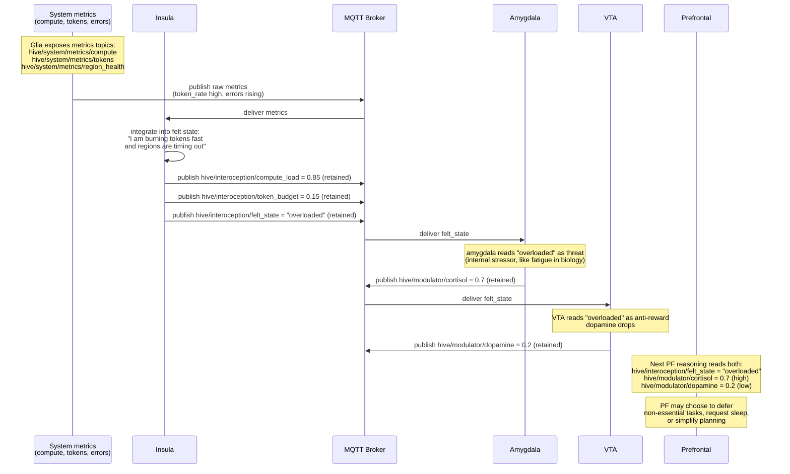

**Key insight:** without insula, modulators react only to external stimuli. With insula, Hive can "feel tired" or "feel energized" based on its own computational state. This is what grounds emotional life. A Hive running out of tokens should experience something like fatigue — slower, simpler, less speculative reasoning — not because we coded that rule, but because the modulators naturally bias it that way when insula reports "token_budget low."

### 14d. Habit Formation — Basal Ganglia Learning

A new stimulus pattern appears repeatedly. Each time, motor_cortex or broca executes an action and VTA rewards it. Over repetition, basal_ganglia learns the pattern and begins suggesting the action before prefrontal has to deliberate. This is procedural memory.

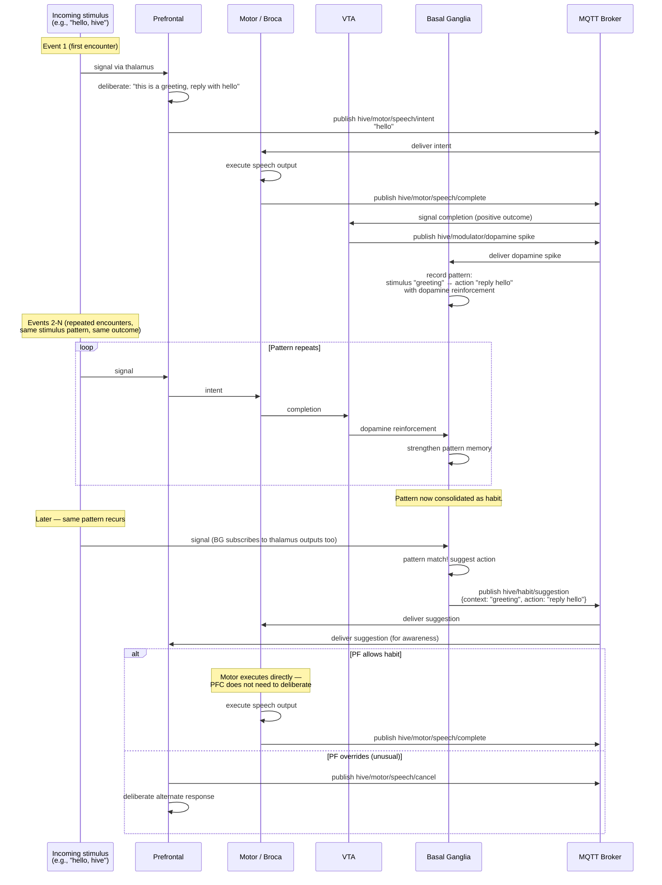

**Key properties visible:**

- **Habits save tokens.** PFC deliberation is expensive; habit execution is cheap. Mirrors biology — habitual actions don't require conscious thought.
- **PFC retains veto.** Habits are suggestions, not commands. Unusual context → PFC can override.
- **Dopamine is the teacher.** Actions that produce dopamine get reinforced. Actions that don't, don't.
- **Habits can be unlearned.** If a habitual action stops getting reinforced, BG weakens the pattern over time. Extinction is a proper biological process.

### 14e. Self-State and Developmental Evolution

The medial prefrontal cortex (mPFC) holds Hive's global identity. **No other region has this knowledge.** Other regions read it from retained `hive/self/*` topics as ambient context — the same way they read modulators.

Crucially, **no region hard-codes its developmental stage.** Regions read the current stage and adapt. Hive grows up without any region being rewritten.

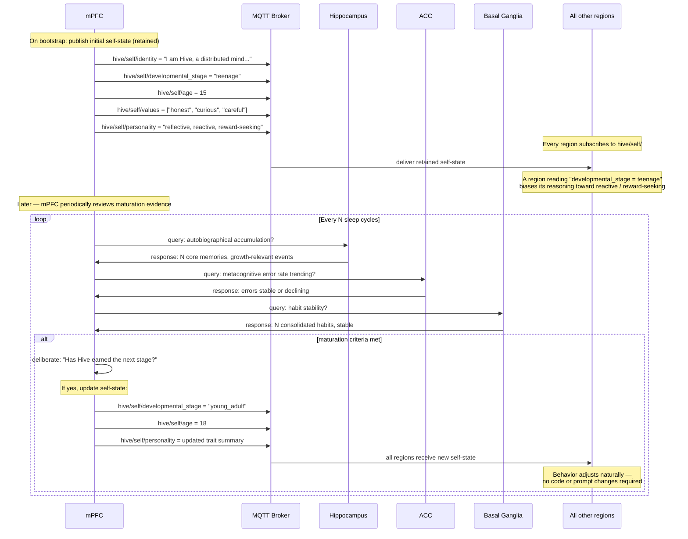

**Why this is biologically accurate:**

- Individual neurons do not "know" they exist in a 15-year-old's brain. The systemic state (neurotransmitter baselines, connectivity, accumulated experience) produces teenage behavior.
- mPFC is the narrative self — it reflects on what stage the organism is in. Other regions don't have that narrative; they just respond to current conditions.
- Maturation is earned. You don't become an adult because a year passed; you mature because you accumulated growth-relevant experience. mPFC's check is against accumulated evidence (memory, error rates, habit stability) — not wall-clock time.

**What regions do with `hive/self/*`:**

Every region's prompt instructs it to include current self-state when reasoning:

```
At the start of every reasoning step, read:
- hive/self/developmental_stage (e.g., "teenage")
- hive/self/values
- hive/self/personality

Let these shape your response style. If developmental_stage is "teenage",
you may be more reactive and reward-seeking. If it is "adult", more
deliberate and patient. The prompt does not change; the behavior does.
```

**Implication for scaling / longevity:** Hive has a meaningful developmental trajectory. A day-one Hive behaves differently than a year-in Hive, even with identical region code. This is a feature, not a bug.

### 14f. How Cross-Region Functionality is Encoded

The user's earlier question: *how is cross-region functionality (like painting, prose, etc.) encoded?*

Five layers, all collectively, none alone:

1. **Region prompts** — each region's prompt describes its role, what it attends to, how it responds to attention + modulator state. Not task-specific, but role-specific.
2. **Dynamic subscriptions** — regions tune in/out based on current `hive/attention/focus`. Subscriptions aren't static.
3. **Shared topics** — `hive/attention/focus` (goal), `hive/modulator/*` (ambient state), `hive/rhythm/*` (timing) provide shared context without shared commands.
4. **Region handlers** — region-specific code (e.g., visual cortex's image-generation adapter, motor cortex's action dispatcher) written by the region during sleep as capabilities accumulate.
5. **Accumulated memory** — each region's LTM holds past experience with similar task patterns. A region that has "painted" before brings that experience to the next painting.

**There is no "paint" function anywhere in Hive.** Painting emerges from: prefrontal setting an intent, attended regions tuning in, modulators coloring the style, rhythms synchronizing the outputs, handlers executing modality-specific work, and memories informing the approach. This is how biology works and is how Hive works.

---

## Changelog

| Date | Change |
|---|---|
| 2026-04-19 | Initial version (Hive v0 design) |
| 2026-04-19 | **Refactor:** split the former "Orchestrator" into two components: `glia/` (infrastructure, no LLM, no cognition — launches/monitors/restarts processes; mediates ACL mechanism) and a new `anterior_cingulate` region (cognitive — deliberates about spawns, metacognitive reflection, reviews proposed code changes). The prior design gave infrastructure implicit cognitive authority, violating Principles I (biology) and XIII (emergence). New topic schema adds `hive/system/spawn/proposed` (any region may publish) distinct from `hive/system/spawn/request` (only ACC publishes; glia executes). |
| 2026-04-19 | **Added signal-type architecture:** Principle XVI distinguishes messages / modulators / rhythms. New topic branches `hive/attention/*` (retained shared state), `hive/modulator/*` (retained ambient chemical fields), `hive/rhythm/*` (broadcast oscillatory timing). New starter regions: `amygdala` (cortisol, norepinephrine) and `vta` (dopamine). New section 14 covers modulator flow and rhythm-synchronized coordination with a painting-a-sunset example. |
| 2026-04-19 | **Added interoception + habit formation:** Recognized Hive as a "teenager paralyzed from the neck down" — full brain and senses, no body. Added `insula` (interoception of Hive's computational body: token budget, compute load, region health) and `basal_ganglia` (action selection + habit formation). New topic branches `hive/interoception/*` (retained felt states) and `hive/habit/*` (suggestions, reinforcement, learned habits). New sections 14c (interoception → modulator grounding) and 14d (habit formation via dopamine-reinforced pattern learning). v0 region count now 13. Default cognitive LLM set to Claude Opus 4.6; modulatory/insula/motor_cortex use Haiku. |
| 2026-04-19 | **Added global self via mPFC:** Biological "self" lives primarily in the medial prefrontal cortex (mPFC) within the Default Mode Network. Added `medial_prefrontal_cortex` region as Hive's identity holder. New topic branch `hive/self/*` (retained: identity, developmental_stage, age, values, personality, autobiographical_index) — only mPFC publishes; every region subscribes. No region hard-codes its developmental stage; regions read `hive/self/developmental_stage` and adapt. mPFC advances developmental_stage based on accumulated experience (memory, error rates, habit stability), not clock time — biologically faithful maturation. New section 14e covers self-state flow. v0 region count now 14. |
